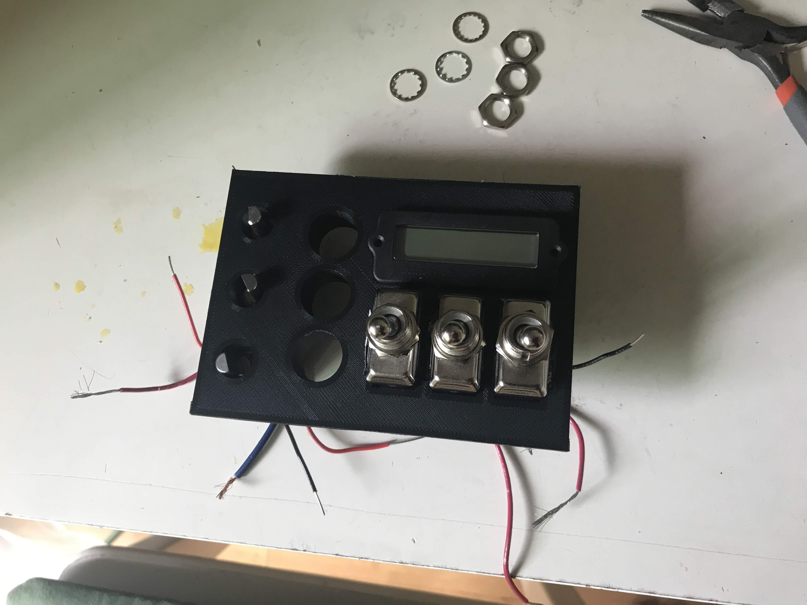
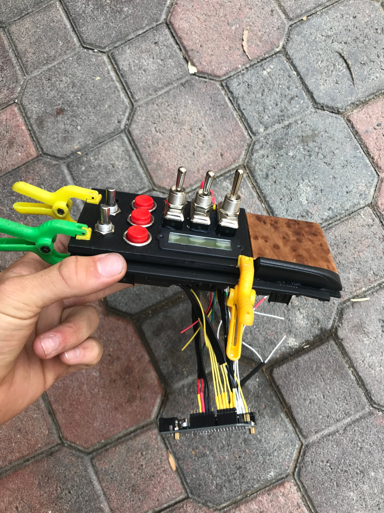
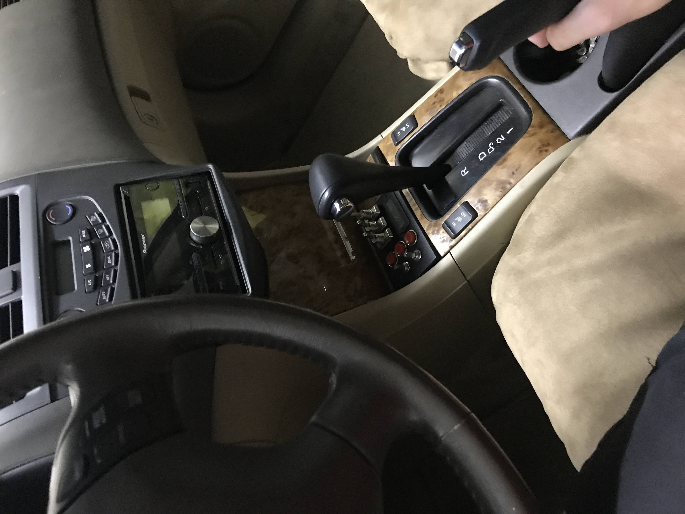
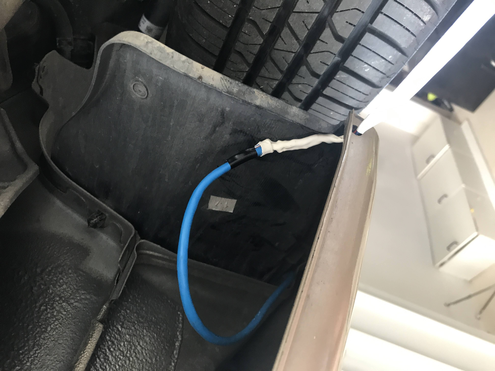

# Underglow Project Description

Idea: I drove a lot of late nights that summer(2020) and loved my car. I also loved LED lights.  

I was looking through photos of a car show I had visisted years prior and it hit me. I can combine my two burning passions, my car and LED lights, into one. I knew all I needed was to be able to control the lights with a microcontroller and power could be supplied through the existing car battery.

## Features
2 sets of 2 independently controllable RGB LED strips
Control panel for various light settings
Ardunio to uniquely control lights
Battery indicator module monitoring the car battery

# Materials
ardunio uno, approx 24ft of LEDS, various switches/buttons, misc connectors

# The Hardware
There are 2 main parts of the physical hardware in this project: the control panel and the LEDs themselves. The control panel was 3D printed to fit into the center console. Not only did this design look great, it allowed easy access to the +12V from the car battery(by connecting in parallel to the seat heater's wiring) to power both the ardunio (accepts 6-20V) and the lights(12V LEDS). The LEDS were glued to the underside of the front and rear bumpers as well as the sides the of car. The main difficulty was routing the wire from the cabin to the outside of the car which was achieved by going through the hole seals in the door. 

# The Code
The function of this code revolves around the  ardunio's analogWrite() function. With analogWrite() we can set a certain PWM duty cycle to one of the ardunio uno's PWM supported pins. Most of the code reads and processes the inputs from the buttons/switches on the control panel. Based on the variables generated from this process, certain light cycles are turned on/off. The code is quite unwieldly due to the fact that the analogWrite() function could not be easily put into a helper function due to factors beyond my level of abstraction.

#  Building

## 3D Printed Control Panel
  

## Panel with Ardunio, Partially Installed
  

## Dash Installation Location
  

## Fully Installed
  

## Blue Wire Routing Visual
  

## Installing Lights
  

  
# Results  

  
Quickly copy pasting some generic RGB LED control code and modifying it to fit my program produced this awesome light show:

https://user-images.githubusercontent.com/52986112/115943701-6e5adc80-a466-11eb-8b8b-517871f967cd.MOV  

Other sequences can be easily uploaded to the ardunio by connecting to a usb routed to the cabin.

